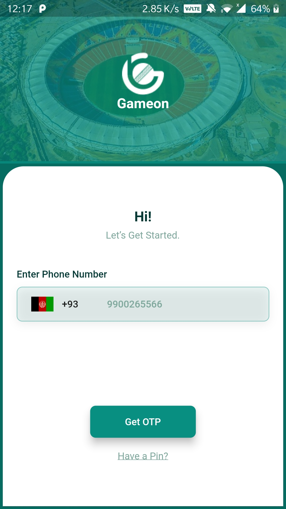
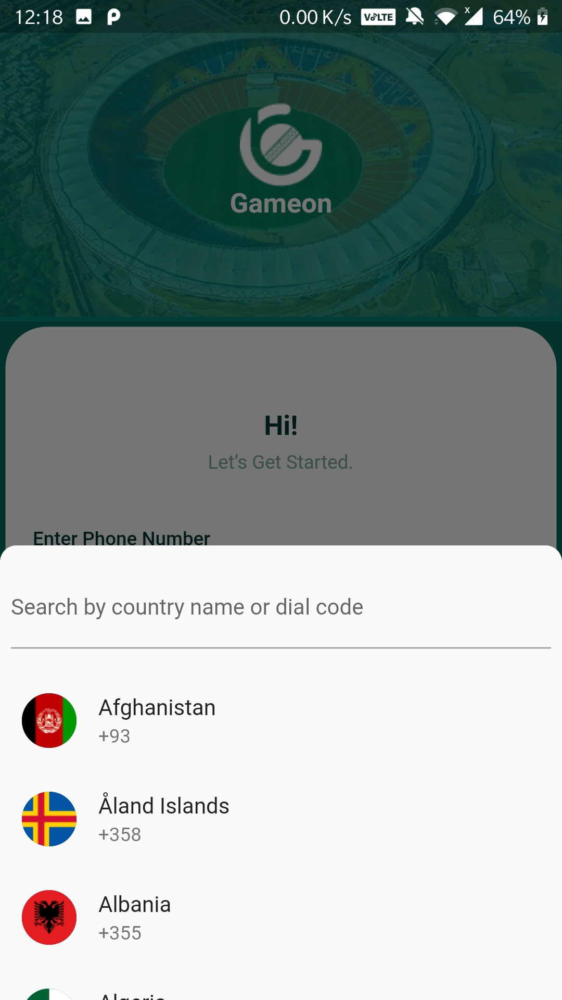
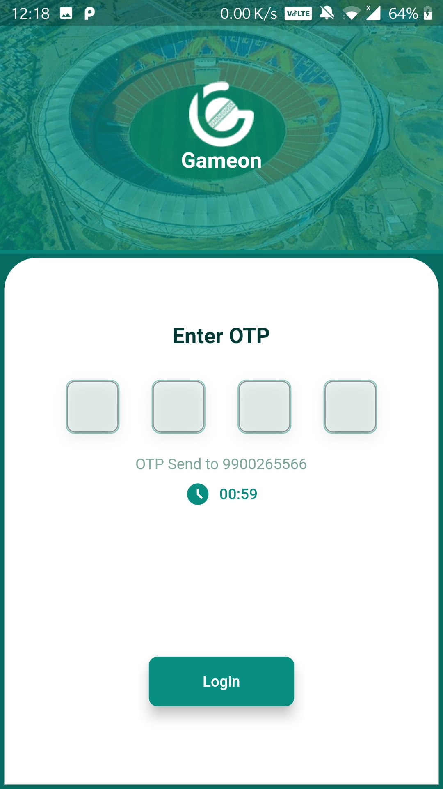
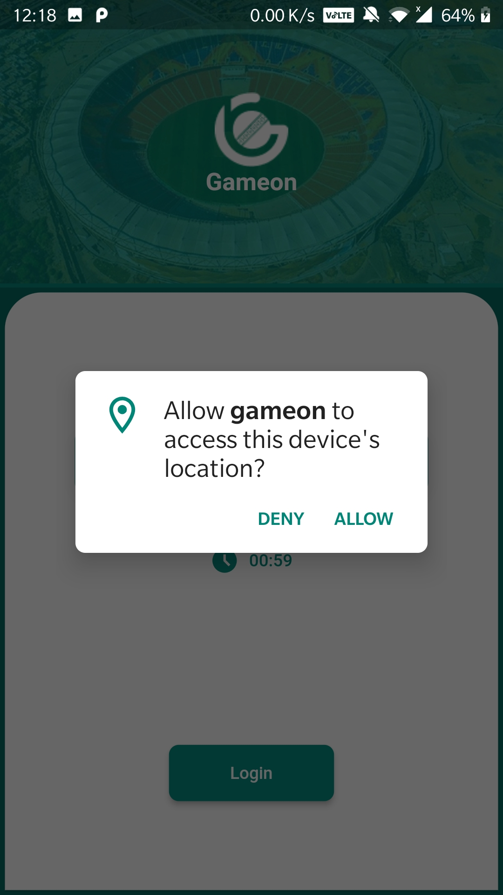
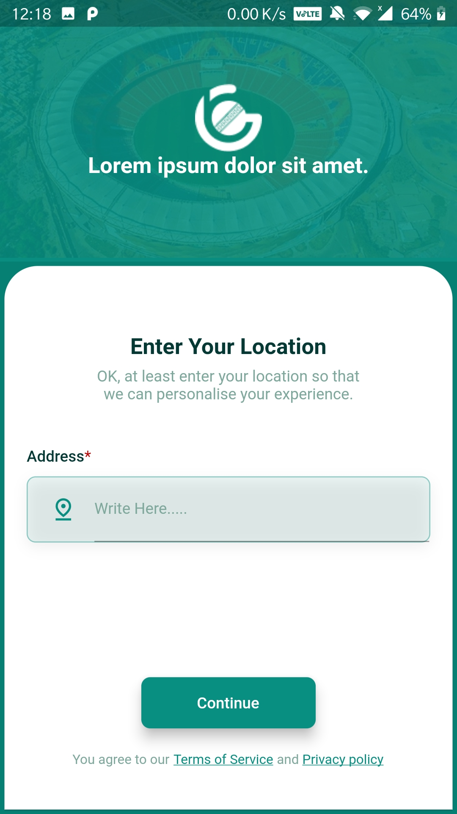
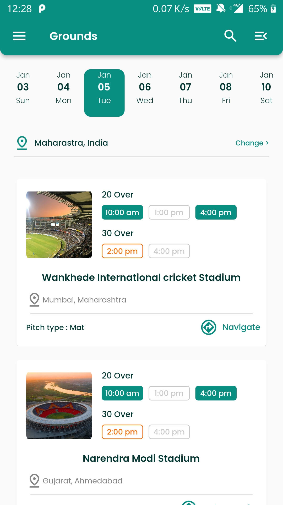
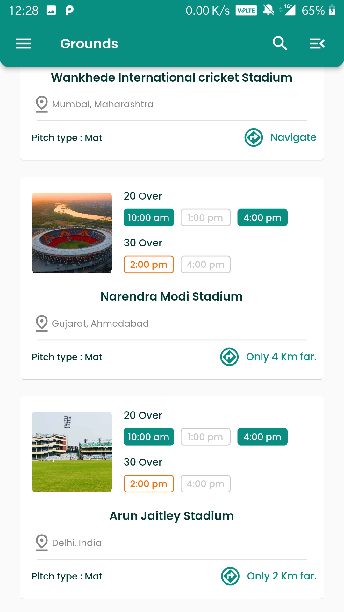
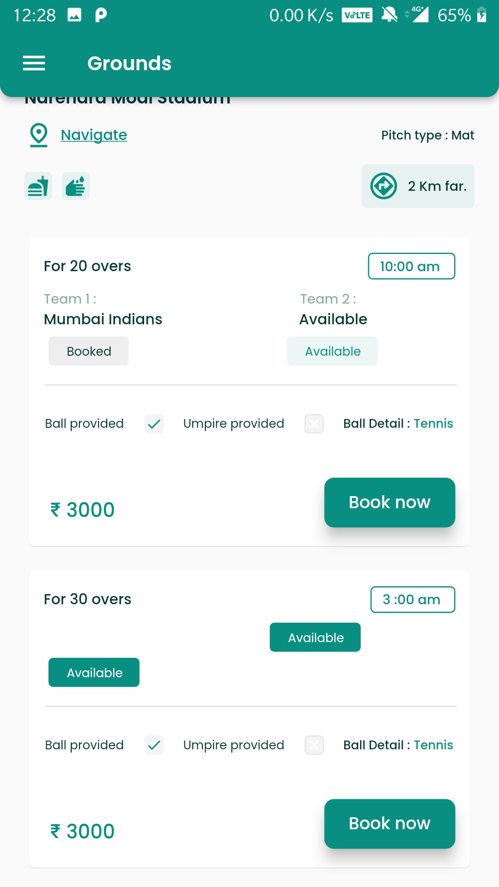

# gameon

Practicing to make complex UI design in Flutter

Sceern shot of the App :-

--------------------------------------------------

--------------------------------------------------

--------------------------------------------------

--------------------------------------------------

--------------------------------------------------

--------------------------------------------------

--------------------------------------------------

--------------------------------------------------

--------------------------------------------------
